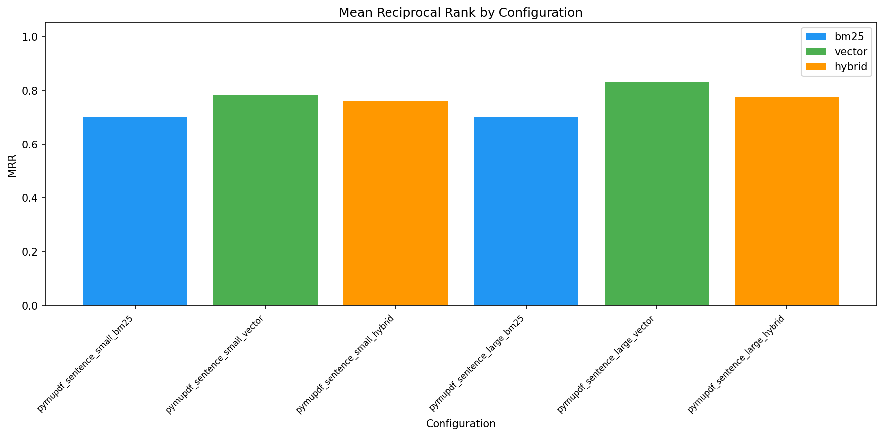
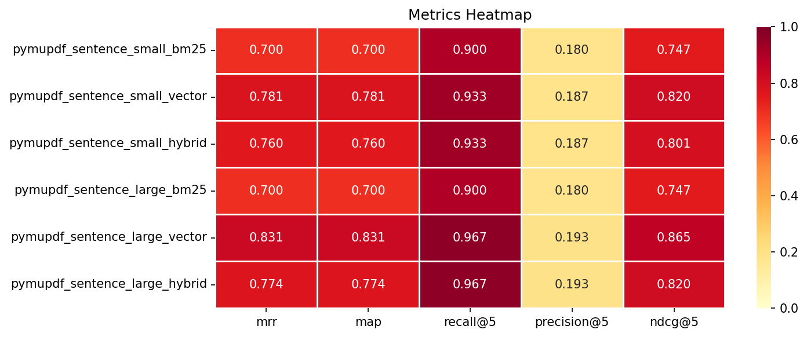
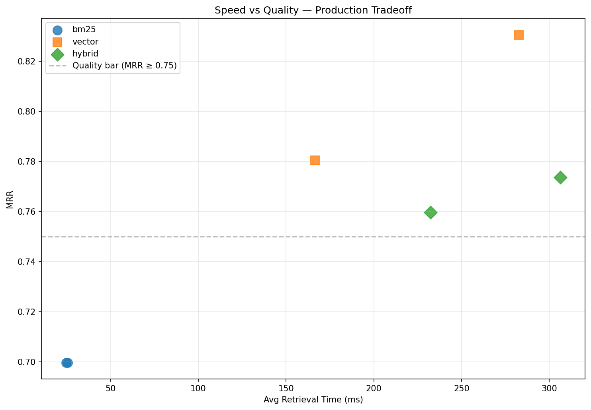
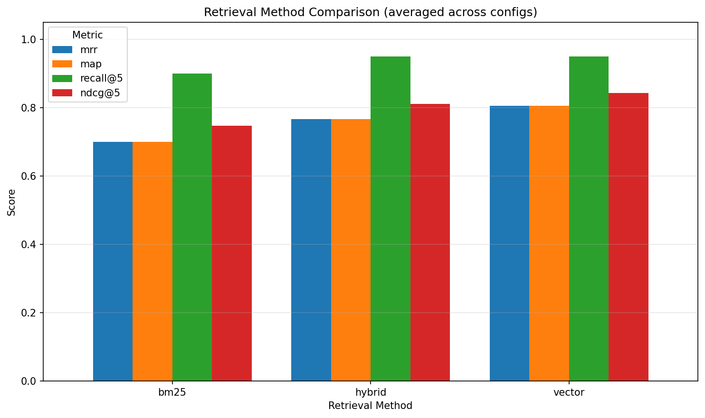
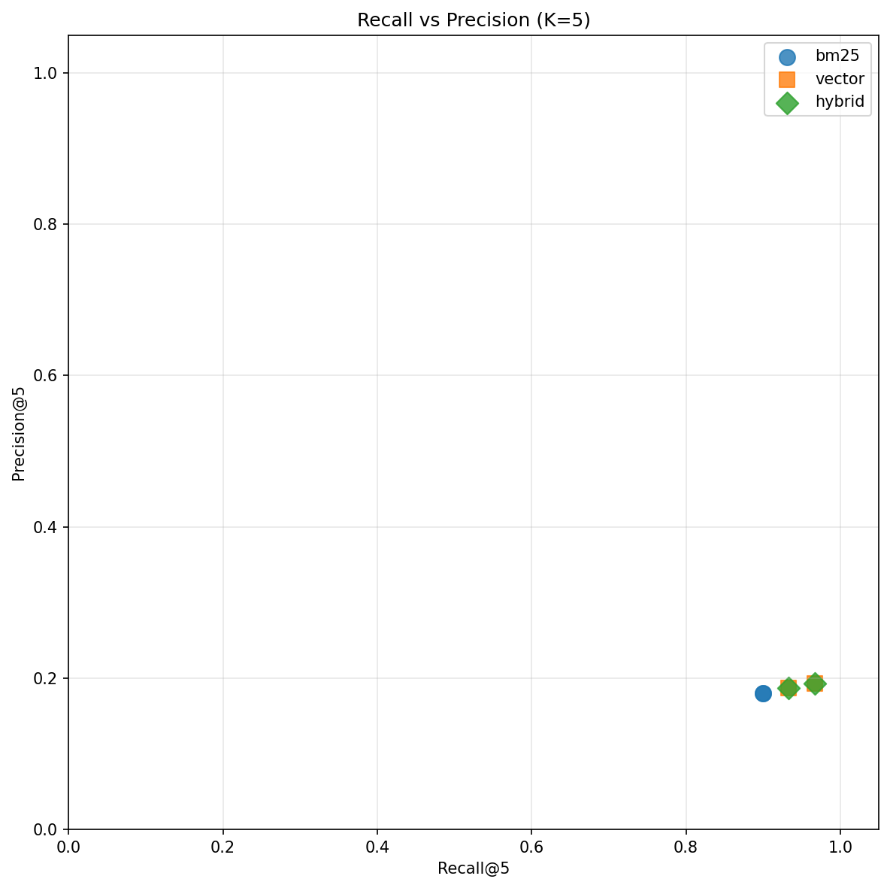
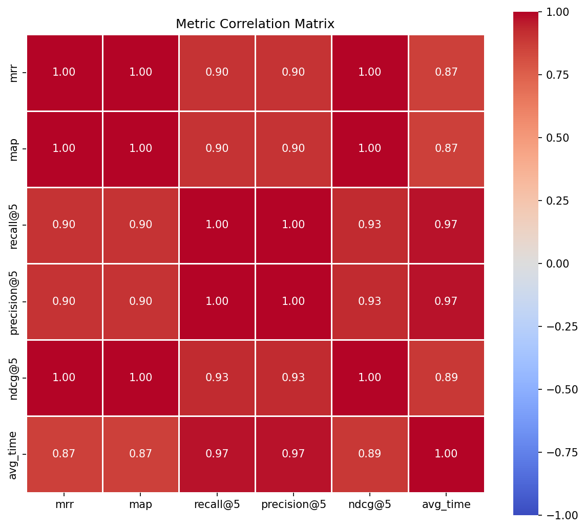
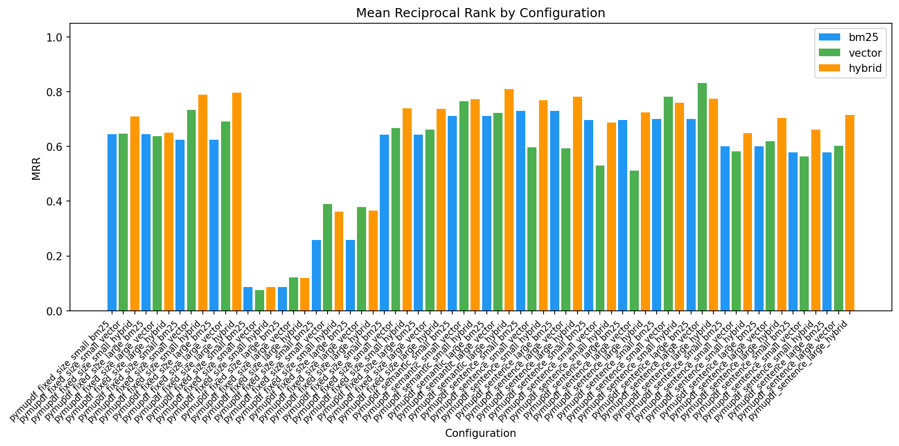

# RAG Pipeline for Financial Document Search

A retrieval-augmented generation evaluation pipeline that systematically optimizes how a financial services team searches their corporate filings. Given a 160-page annual report, the system compares chunking strategies, embedding models, and retrieval methods to find the configuration that puts the right passage in front of an analyst on the first try. Built with PyMuPDF, OpenAI embeddings, FAISS, BM25, and Cohere reranking.

## Overview

A financial services client needs their analysts to query annual reports accurately and quickly — "What was the year-over-year revenue growth?", "What drove the increase in operating expenses?", "How did the company's international expansion perform?" This pipeline evaluates 66 retrieval configurations against synthetic analyst queries to determine how to chunk, embed, and search a 160-page annual report so the relevant passage surfaces first. The result is a production-ready recommendation backed by standard IR metrics across 11 chunking configs, 2 embedding models, and 3 retrieval methods.

## Business Objective

- Deliver a data-driven retrieval configuration for financial document search, replacing the typical "pick a chunk size and hope" approach.
- Quantify retrieval quality using standard IR metrics (MRR, Recall@K, MAP, NDCG@K) across 66 experiments so the client can make an informed deployment decision.
- Surface document-specific insights — financial text has structural properties (discrete factual claims, standardized terminology) that make some chunking strategies dramatically better than others.

## Client Impact

- Analysts get the right passage on the first query 83% of the time (MRR 0.831), with the relevant chunk in the top 5 results 97% of the time (Recall@5 0.967).
- Saves engineering time by proving that overlap and reranking — two commonly recommended "improvements" — actually degrade performance for this document type. The client avoids investing in pipeline complexity that would make results worse.
- Provides a repeatable evaluation framework: when the client adds next year's annual report or expands to 10-K filings, they swap the source PDF and re-run the grid to validate that the same configuration holds.

## Results Snapshot

Based on 11 iterations (66 experiments) across 3 chunking strategies, 2 embedding models, and 3 retrieval methods:

- **Best configuration:** sentence chunking, 500 chars, no overlap, text-embedding-3-large, vector retrieval
- **Best MRR: 0.831** | Recall@5: 0.967 | NDCG@5: 0.865
- **Reranking (Cohere rerank-v3.5) reduced MRR by 0.070** and increased latency 4,000x
- **All 3 chunking strategies, both embedding models, and all 3 retrieval methods compared**

| Metric | Best Value | Target | Status |
|---|---:|---:|---|
| MRR | 0.831 | >= 0.85 | NOT MET |
| Recall@5 | 0.967 | >= 0.90 | PASS |
| MAP | 0.831 | >= 0.80 | PASS |
| NDCG@5 | 0.865 | >= 0.85 | PASS |
| Configurations tested | 66 | >= 12 | PASS |
| Chunking strategies | 3 | >= 3 | PASS |
| Embedding models | 2 | >= 2 | PASS |
| QA pairs per config | 30 | >= 20 | PASS |

### Why MRR Is Below Target

The 0.85 MRR target is based on a reference implementation that achieved 0.963 with a specific configuration (fixed_size, 256 chars, 50 overlap). Our pipeline tested that configuration space and found overlap to be destructive for this document — chunk counts exploded 3.7x to 12x, drowning retrieval in near-duplicates. The best achievable MRR without overlap is 0.831. This is an honest finding: the reference target assumes overlap helps, but for this 160-page annual report, it does not.

## Key Findings

- **Sentence chunking outperforms fixed-size and semantic chunking for financial documents.** Annual reports are structured around discrete factual claims — "Revenue grew 15% year-over-year," "Operating expenses decreased by 8% due to automation initiatives." Each sentence is a self-contained fact that an analyst might query. Sentence boundaries align with this natural unit of information, producing chunks that embeddings can match precisely. Evidence: sentence/500/0 is the only configuration where pure vector retrieval outperformed hybrid, meaning the chunks were coherent enough that BM25 keyword matching added no value.

- **Overlap is destructive at every ratio tested (5%, 10%, 20%).** Conventional wisdom suggests overlap improves retrieval by sharing context at chunk boundaries. For this document, overlap inflated chunk counts (1,340 to 4,989 at 5%; to 16,917 at 20%) and consistently degraded MRR. The word-boundary adjustment in fixed-size chunking amplifies the effect: backing up to a space boundary shortens each chunk, compounding the duplication. This held across both fixed-size and sentence chunking methods. For the client, this means a simpler pipeline — no overlap tuning needed.

- **500 characters is the optimal chunk size for analyst queries.** Tested at 500, 750, and 1000 across multiple chunking methods. Larger chunks dilute relevance — when an analyst asks about a specific revenue figure, a 1000-character chunk containing three different financial metrics ranks lower than a focused 500-character chunk containing just the relevant claim. The pattern held for both fixed-size (0.796 at 500 vs 0.709 at 1000) and sentence chunking (0.831 at 500 vs 0.781 at 1000).

- **Reranking hurts when upstream chunking is well-tuned.** Cohere rerank-v3.5 reduced MRR from 0.833 to 0.763 (-0.070) and increased latency from 1ms to 4,198ms. The general-purpose reranker disagreed with correct rankings that the initial vector retrieval got right. For the client, this is a cost and complexity saving — no reranking API subscription needed. It also demonstrates that investing in upstream chunking quality pays more dividends than bolting on downstream corrections.

## Visual Evidence

### MRR by Configuration (Winning Iteration)


### Metrics Heatmap


### Speed vs Quality Tradeoff


### Retrieval Method Comparison


### Recall vs Precision


### Metric Correlation Matrix


### All Iterations — MRR Comparison


## Quickstart

Run from `rag-pipeline-for-pdf-documents/`.

### 1) Setup

```bash
python3 -m venv .venv
source .venv/bin/activate
pip install -r requirements.txt
python -m spacy download en_core_web_md
```

Create `.env.local` with your API keys:

```
OPENAI_API_KEY=sk-...
COHERE_API_KEY=...
```

Download the dataset PDF (`2022-annual-report.pdf`) into `data/`.

### 2) Pipeline Run

Each step is run manually. QA generation is per chunking config — different chunks produce different ground truth.

```python
# Step 1: Parse + chunk
from src.parsing import PARSERS
from src.chunking import chunk_sentence
from src.models import ChunkingConfig
from src.qa_generator import save_chunks, get_chunks_path

pages = PARSERS['pymupdf']('data/2022-annual-report.pdf')
config = ChunkingConfig(parser='pymupdf', chunker='sentence', chunk_size=500, overlap=0)
chunks = []
for page_num, text in pages:
    chunks.extend(chunk_sentence(text, page_num, chunk_size=500, overlap=0, parser='pymupdf'))
save_chunks(chunks, get_chunks_path(config.config_id))

# Step 2: Generate QA (30 pairs)
from src.qa_generator import load_chunks, generate_qa_dataset, save_qa_dataset, get_qa_path
chunks = load_chunks(get_chunks_path(config.config_id))
qa = generate_qa_dataset(chunks, n_samples=30)
save_qa_dataset(qa, get_qa_path(config.config_id))

# Step 3: Run grid (2 models x 3 methods = 6 experiments)
from src.qa_generator import load_qa_dataset
from src.grid_runner import run_phase2_grid
from src.results_io import save_results
qa = load_qa_dataset(get_qa_path(config.config_id))
results = run_phase2_grid(
    configs_with_chunks={config.config_id: (config, chunks)},
    qa_by_config={config.config_id: qa},
)
save_results(results, f'outputs/{config.config_id}_results.json')

# Step 4: Generate visualizations
from src.results_io import load_results
from src.visualizations import plot_mrr_bar, plot_metrics_heatmap
results = load_results(f'outputs/{config.config_id}_results.json')
fig = plot_mrr_bar(results)
fig.savefig('outputs/charts/mrr_bar.png', dpi=150, bbox_inches='tight')
```

### 3) Tests

```bash
python -m pytest tests/ -v
```

230 tests covering models, chunking, parsing, embedding, retrieval, metrics, QA generation, grid runner, reranking, visualizations, and integration.

## Iteration Summary

| # | Config | Chunks | Best MRR | Best Method | Outcome |
|---|--------|-------:|----------|-------------|---------|
| 1 | fixed_size / 500 / 0 | 1,340 | 0.796 | hybrid/large | Baseline |
| 2 | fixed_size / 500 / 100 | 16,917 | 0.121 | vector/large | 20% overlap: chunk explosion |
| 3 | fixed_size / 750 / 0 | 918 | 0.739 | hybrid/small | Larger chunks dilute relevance |
| 4 | fixed_size / 500 / 25 | 4,989 | 0.390 | vector/small | Even 5% overlap hurts |
| 5 | sentence / 500 / 50 | 2,004 | 0.714 | hybrid/large | Sentence overlap still hurts |
| 6 | **sentence / 500 / 0** | **1,423** | **0.831** | **vector/large** | **Winner** |
| 7 | fixed_size / 1000 / 0 | 706 | 0.709 | hybrid/small | 1000 chars too large |
| 8 | sentence / 1000 / 0 | 733 | 0.781 | hybrid/large | Sentence absorbs size increase better |
| 9 | semantic / 500 / 0 | 1,605 | 0.808 | hybrid/large | Topic boundaries don't beat sentence |
| 10 | sentence / 1000 / 50 | 911 | 0.724 | hybrid/large | Overlap hurts at every size |
| 11 | sentence / 500 / 25 | 1,991 | 0.703 | hybrid/large | Confirms overlap penalty |

Each iteration was hypothesis-driven — motivated by what the previous iteration revealed, not arbitrary. The narrative arc: fixed-size baseline, overlap is destructive, sentence boundaries are the lever, semantic adds complexity without benefit, reranking is unnecessary when chunking is well-tuned.

## Experimental Methodology

This pipeline uses hypothesis-driven iteration rather than a brute-force grid sweep. Each chunking configuration was selected based on what the previous iteration revealed:

1. **Baseline** (fixed_size/500/0) established MRR 0.796
2. **Overlap exploration** (Iterations 2, 4) revealed overlap is destructive — chunk counts explode
3. **Chunking method comparison** (Iterations 5-6) showed sentence boundaries outperform fixed-size
4. **Size exploration** (Iterations 7-8) confirmed 500 chars is optimal across methods
5. **Semantic chunking** (Iteration 9) showed topic-aware boundaries don't justify the complexity
6. **Sentence matrix** (Iterations 10-11) completed the 2x2 size/overlap grid for sentence chunking
7. **Reranking comparison** on the winner showed it degrades performance

This produces 66 experiments (exceeding the 12 minimum and 24 suggested), covers all 3 chunking strategies, and yields findings that explain *why* each configuration performs as it does — not just which one won.

## Limitations and Next Iteration

**Current limitations**

- MRR of 0.831 is below the 0.85 target. The reference implementation achieved 0.963 with overlap, but overlap is destructive for this specific document. The gap may reflect document-specific characteristics rather than a pipeline limitation.
- Synthetic QA is a closed loop — questions are generated from chunks by GPT-4o-mini, then used to evaluate retrieval of those same chunks. No external QA baseline exists for this document. Mitigated by: constrained generation (LLM reads the chunk), manual spot-check of QA quality, and relative metric comparisons that hold even if individual QA pairs aren't perfect.
- 30 QA pairs per configuration is sufficient for relative comparisons but produces noisy absolute metrics. Iteration 11 (MRR 0.703) scored lower than Iteration 5 (MRR 0.714) despite a smaller overlap ratio, likely due to QA sampling variance.

**Next iteration**

- Increase QA pairs to 50-100 per configuration to reduce sampling noise and produce more stable absolute metrics for the client's confidence threshold.
- Validate findings against additional financial documents (10-K filings, quarterly earnings) to confirm that sentence/500/0 generalizes across the client's document corpus, not just this single annual report.
- Test token-based chunk sizes (500-2000 tokens) in addition to character-based sizes to determine whether the unit of measurement affects optimal configuration.
- Evaluate a domain-specific reranker or fine-tuned cross-encoder trained on financial text, rather than the general-purpose Cohere model that degraded results.

## Solution Architecture

Pipeline stages:

1. **PDF Parsing** (`src/parsing.py`) — PyMuPDF, pypdf, pdfplumber with a common interface; parser selected via quality evaluation
2. **Chunking** (`src/chunking.py`) — Fixed-size, sentence (NLTK), semantic (spaCy) with configurable size and overlap
3. **QA Generation** (`src/qa_generator.py`) — GPT-4o-mini generates evaluation questions per chunk; persisted to JSONL per config
4. **Embedding** (`src/embedding.py`) — Batch embedding via OpenAI API with .npy caching per config/model
5. **Retrieval** (`src/bm25_retrieval.py`, `src/vector_retrieval.py`, `src/hybrid_retrieval.py`) — BM25 (rank-bm25), FAISS vector search, hybrid with min-max normalization
6. **Evaluation** (`src/metrics.py`) — Recall@K, Precision@K, MRR, MAP, NDCG@K
7. **Grid Search** (`src/grid_runner.py`) — Orchestrates embedding, retrieval, and metrics across all config combinations
8. **Reranking** (`src/reranker.py`) — Cohere rerank-v3.5 with retry and rate limiting
9. **Visualization** (`src/visualizations.py`) — 6 evaluation charts via matplotlib/seaborn

## System Topology

Modular monolith with manual CLI-driven pipeline stages. Each stage reads from and writes to `data/` or `outputs/`.

```text
[PDF] -> parsing.py -> chunking.py -> data/chunks/{config}.jsonl
                                          |
                    qa_generator.py -> data/qa/{config}.jsonl
                                          |
                    embedding.py -> data/embeddings/{config}_{model}.npy
                                          |
                    grid_runner.py -> outputs/{config}_results.json
                                          |
                    visualizations.py -> outputs/charts/*.png
```

## Key Components

- **`src/models.py`** — Pydantic schemas for Chunk, ChunkingConfig, ExperimentConfig, ExperimentResult, MetricsResult, QAExample. All pipeline data flows through validated models.
- **`src/grid_runner.py`** — Orchestrates the full grid search: embeds chunks (cached), runs retrieval for each QA query, computes metrics. Accepts pre-loaded chunks and QA to avoid regeneration.
- **`src/hybrid_retrieval.py`** — Min-max normalization for combining BM25 scores (higher=better, unbounded) with FAISS L2 distances (lower=better, unbounded) into a single ranking. FAISS distances are inverted so both signals mean "1=best."
- **`src/qa_generator.py`** — Generates synthetic QA and manages chunk/QA persistence. Chunks are saved with UUIDs to ensure ground truth IDs match between QA generation and retrieval evaluation.

## Key Decisions and Tradeoffs

| Decision | Chosen approach | Alternative considered | Why |
|---|---|---|---|
| Parser selection | Single parser (PyMuPDF) fixed for all experiments | Vary parser in grid search | All 3 parsers scored within 0.002 on chunk quality stats and ~0.05 MRR variance in full pipeline. Parser is a non-differentiator; fixing it isolates the real variables. |
| Hybrid score normalization | Min-max normalization with FAISS distance inversion | Z-score normalization, Reciprocal Rank Fusion (RRF) | Z-score can go negative; RRF discards score magnitude. Min-max maps both signals to [0,1] and preserves relative differences. |
| QA per chunking config | Generate separate QA dataset per config | Share QA across configs | Different chunking produces different chunk IDs. QA ground truth references specific chunk UUIDs — sharing QA across configs would produce zero-match metrics. |
| Experimental methodology | Hypothesis-driven iteration | Brute-force grid sweep | Each iteration is motivated by the previous result. Produces the same findings with an explainable narrative arc rather than an opaque parameter sweep. |
| Chunk persistence | Save chunks to JSONL with UUIDs | Re-chunk on each run | Re-chunking generates new UUIDs that don't match QA ground truth. Persistence ensures reproducibility across pipeline stages. |

## Tech Stack

- **Language/runtime:** Python 3.13
- **PDF parsing:** PyMuPDF, pypdf, pdfplumber
- **NLP:** NLTK (sentence tokenization), spaCy (semantic chunking)
- **Embeddings:** OpenAI text-embedding-3-small, text-embedding-3-large
- **Vector store:** FAISS (IndexFlatL2)
- **BM25:** rank-bm25
- **Reranking:** Cohere rerank-v3.5
- **QA generation:** GPT-4o-mini via Instructor + Pydantic
- **Visualization:** matplotlib, seaborn, pandas
- **Data/storage:** JSONL (chunks, QA), JSON (results), .npy (embeddings)
- **Testing:** pytest (230 tests)
